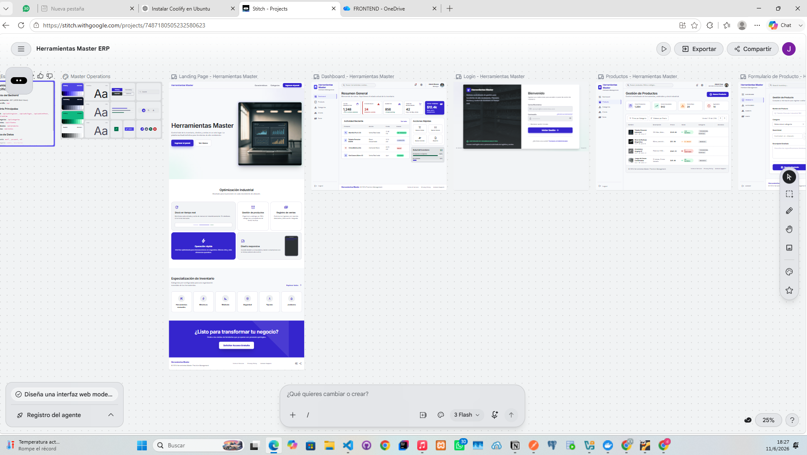
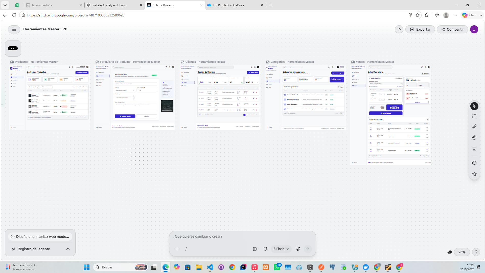
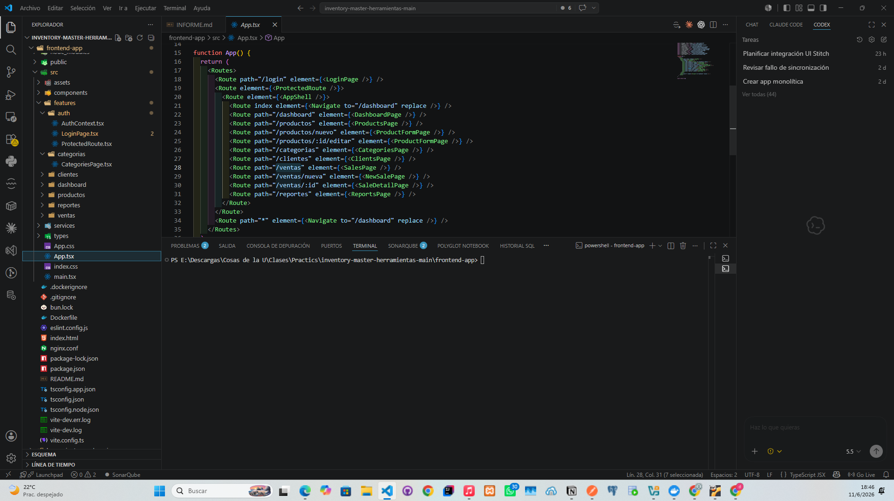
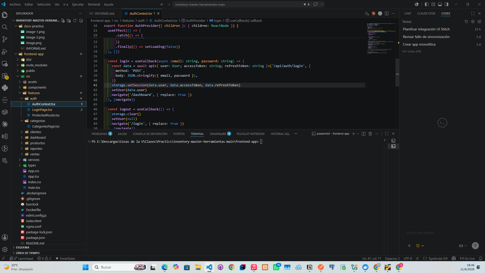
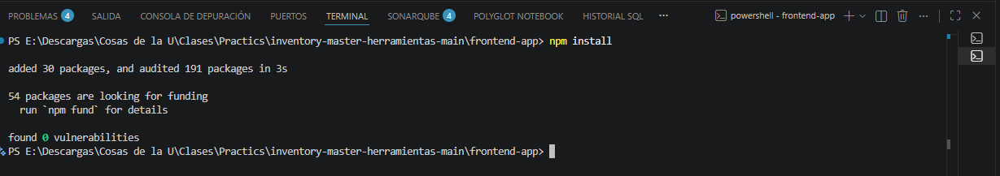
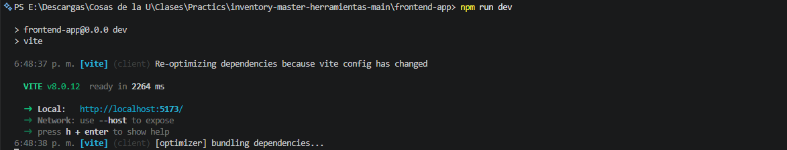
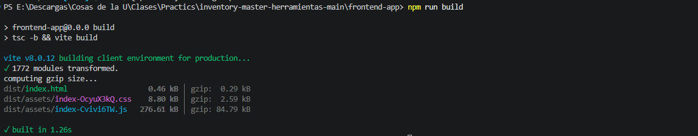
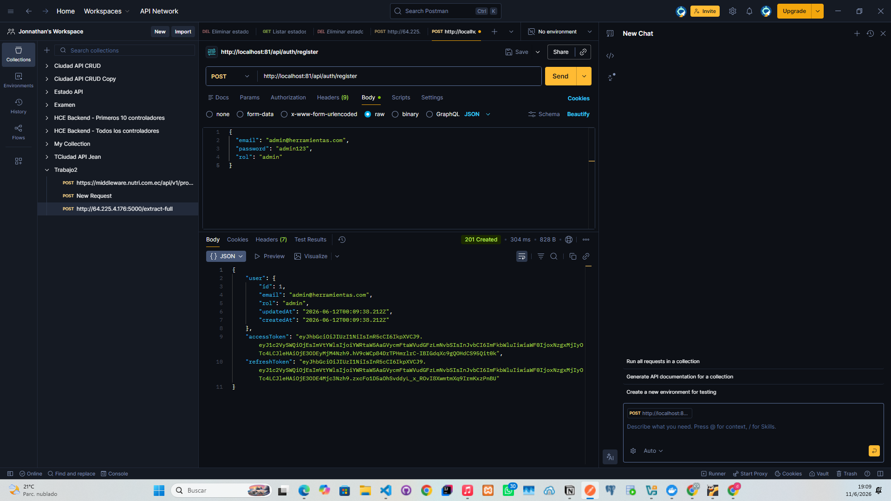

PROMPT 

Diseña una interfaz web moderna, sobria y profesional para un sistema de inventario y ventas de herramientas llamado Herramientas Master.
La aplicación debe sentirse como un sistema real de operación diaria: clara, rápida, ordenada, confiable y lista para integrarse con una API REST protegida con JWT.
Contexto del backend
La aplicación usa una API REST con autenticación JWT.
Endpoints principales:

Auth:

/api/auth/register

/api/auth/login

/api/auth/refresh

/api/auth/me

Categorías:

/api/categorias

Clientes:

/api/clientes

Productos:

/api/productos

Ventas:

/api/ventas
Entidades disponibles
Usuario:
   - email
   - password
   - rol
   - Categoría:
   - nombre
   - descripcion
Producto:
   - nombre
   - descripcion
   - precio
   - stock
   - categoriaId

Cliente:
   - identificacion
   - nombres
   - apellidos
   - email
   - telefono
   - direccion
Venta:
   - clienteId
   - fecha
   - total
   - detalles[]
Detalle de venta:
   - productoId
   - cantidad
   - precioUnitario
   - subtotal
   - Estilo visual general
   - Usa una estética minimalista, profesional y confiable.
Requisitos visuales:
- Fondo claro tipo slate.
- Superficies blancas.
- Color principal indigo.
- Tipografía moderna y legible.
- Bordes suaves.
- Separación visual clara.
- Estados hover sutiles.
- Diseño responsive para desktop, tablet y móvil.
- Evitar gradientes exagerados.
- Evitar sombras pesadas.
- Evitar layouts genéricos.
- No usar JavaScript salvo que sea necesario para mostrar estados visuales.
- Pantallas requeridas
1. Landing Page
Crear una landing page comercial para Herramientas Master.
Debe incluir:
- Hero principal.
- Nombre de la marca.
- Eslogan.
- Botón CTA.
- Sección de características.
- Sección de categorías de herramientas.
Footer.
- Contenido del hero:
- Nombre: Herramientas Master
- Eslogan: Control total de tu inventario, clientes y ventas en un solo lugar.
- CTA principal: Ingresar al panel
- Características sugeridas:
- Control de stock en tiempo real.
- Gestión de productos y categorías.
- Registro de clientes y ventas.
- Flujo rápido para operación diaria.
- Diseño claro para escritorio y móvil.
- Categorías de herramientas en cards:
- Herramientas manuales.
- Herramientas eléctricas.
- Medición.
- Seguridad.
- Fijación.
- Jardinería.
- Cada card debe tener:
- Nombre.
- Descripción breve.
- Ícono o elemento visual simple.
2. Login
- Crear una pantalla de login centrada.
- Debe incluir:
- Formulario de acceso.
- Campo email.
- Campo password.
- Botón principal para iniciar sesión.
- Texto breve de apoyo relacionado con gestión de inventario.
- Diseño limpio, seguro y profesional.
3. Dashboard
- Crear una pantalla de administración con:
- Sidebar de navegación.
- Header superior.
- Tarjetas KPI.
- KPIs sugeridos:
- Total de productos.
- Stock bajo.
- Clientes registrados.
- Ventas realizadas.
- Total vendido.
- También incluir:
- Actividad reciente.
- Resumen operativo.
- Accesos rápidos a productos, clientes, categorías y ventas.
4. Productos
- Crear pantalla de listado CRUD para productos.
- Debe incluir:
- Tabla de productos.
- Botón para crear nuevo producto.
- Buscador visual.
- Filtros visuales simples.
- Acciones: ver, editar, eliminar.
- Columnas:
- nombre
- descripcion
- precio
- stock
- categoriaId
- acciones
- Estados visuales:
- Stock normal.
- Stock bajo.
- Agotado.
5. Formulario de producto
- Crear formulario para crear y editar productos.
- Campos:
- nombre
- descripcion
- precio
- stock
- categoriaId
- Debe incluir:
- Botón guardar.
- Botón cancelar.
- Validaciones visuales para campos requeridos.
- Validaciones visuales para valores numéricos.
- Diseño claro para uso administrativo.
6. Categorías
Crear pantalla de gestión de categorías.
- Campos:
- nombre
- descripcion
- Debe incluir:
- Tabla o cards.
- Botón crear categoría.
- Acciones: editar y eliminar.
- Diseño consistente con el dashboard.
7. Clientes
- Crear pantalla CRUD para clientes.
- Columnas:
- identificacion
- nombres
- apellidos
- email
- telefono
- direccion
- acciones
- Debe incluir:
- Botón crear cliente.
- Buscador visual.
- Acciones: ver, editar y eliminar.
- Diseño claro para lectura rápida de datos.
8. Ventas
- Crear pantalla de ventas.
- Debe incluir:
- Tabla de ventas con:
- fecha
- cliente
- total
- acciones
- También crear una vista o sección para nueva venta con:
- Selección de cliente usando clienteId.
- Detalle de productos usando detalles[].
- Cada detalle debe usar:
- productoId
- cantidad
- Mostrar visualmente:
- precio unitario
- subtotal
- total
- cantidad de ítems
- La pantalla debe permitir entender claramente el flujo de registrar una venta.
- Reglas importantes
- Usa únicamente campos que existen en el backend.
- No inventes campos adicionales.
- La interfaz debe parecer lista para conectarse a una API JWT.
- Mantén consistencia visual entre todas las pantallas.
- Prioriza claridad, jerarquía visual y facilidad de uso.
- Los datos de ejemplo deben ser coherentes con una tienda de herramientas.
- Formato de entrega
- Devuelve el código HTML y CSS separado por pantalla.
- Estructura esperada:
- landing.html
- landing.css
- login.html
- login.css
- dashboard.html
- dashboard.css
- productos.html
- productos.css
- producto-form.html
- producto-form.css
- categorias.html
- categorias.css
- clientes.html
- clientes.css
- ventas.html
- ventas.css
- Capturas necesarias para informe
- El diseño debe permitir tomar capturas claras de:
- Landing Page.
- Login.
- Dashboard.
- Productos.
- Formulario de producto.
- Categorías.
- Clientes.
- Ventas.
- El resultado final debe verse como un sistema administrativo real, profesional y funcional para gestionar inventario, clientes y ventas de herramientas.

**Fotos de stitch**

**Rutas**

**Login**

**Verifica localmente**
- npm install

- npm run dev

- npm run build 

- Foto del token generado

**Imagen de la app desplegada**
